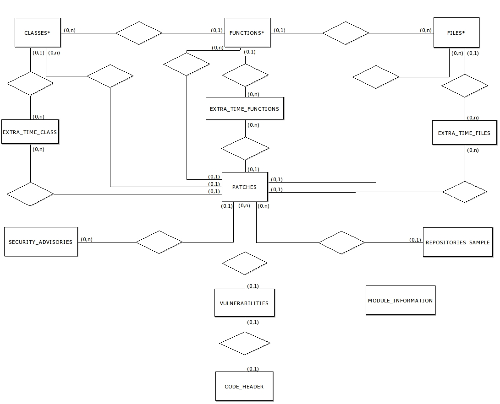

# Scripts

This directory includes the following Python scripts. Unless noted otherwise, assume that every script that connects to a database allows you to configure certain parameters (host, port, credentials, etc).

* `import-dataset.py:` imports the software vulnerability and metrics dataset into a MySQL database called 'software'. The MySQL server must be started before using this script. By default, this script imports the data without the timeline information (extra_time tables). To import the complete dataset, use the `-complete` command line argument.

* `add-cwe-to-vulnerabilities.py:` queries the software vulnerability database for any CVE record that is missing its respective CWE value. This value is then scraped from the [CVE Details website](https://www.cvedetails.com/) and added to the 'V_CWE' column in the 'vulnerabilities' table.

* `add-vulnerability-categories-and-cwe-information.py:` creates or updates two tables in the software vulnerability database:
	
    * 'vulnerability_categories', which contains the names of various vulnerability categories.

    * 'cwe_info', which maps a CWE value to its description/summary and one of the category in the previous table. These descriptions are scraped from the "cwe.mitre.org" website.

* `explore-cve-details-scraper.py:` explores the information available in the [CVE Details website](https://www.cvedetails.com/) by using its JSON API and by scraping some of its CVE pages. No connections to the software vulnerabilities database are made.

* `explore-mfsa-scraper.py:` explores the information available in the [Mozilla Foundation Security Advisories (MFSA) website](https://www.mozilla.org/en-US/security/advisories/) by scraping some of its pages. No connections to the software vulnerabilities database are made.

* `run-sats.py:` currently explores the various types of data that are generated by static analysis tools (SATs). The goal is to eventually add some of this information to the software vulnerability database. This script uses the SATs [Cppcheck](http://cppcheck.sourceforge.net/) and [Flawfinder](https://dwheeler.com/flawfinder/).

## Requirements

The following Python libraries are required to run all of the previous scripts. Check the comment at the top of each script to see its specific dependencies. These may be obtained using the [`pip`](https://pypi.org/project/pip/) package installer:

```
pip install mysql-connector-python
pip install requests
pip install beautifulsoup4
pip install lxml
```

## Usage Order

Before most scripts can be used, the dataset must be imported into a database using `import-dataset.py`, with or without the `-complete` option depending on the desired information.

The CWE values are first added to an existing table in the database by using `add-cwe-to-vulnerabilities.py`. Then, `add-vulnerability-categories-and-cwe-information.py` is run to add the vulnerability categories table (if it doesn't exist), and to create or update another table which maps these CWE values to their respective category.

The script `run-sats.py` currently does not connect to the database, but it will eventually add the information generated by SATs to new tables.

The scripts `explore-cve-details-scraper.py` and `explore-mfsa-scraper.py` do not depend on the software vulnerability database and may be used in any order.

## Database Relationship Diagram

The following image shows a simplified version of the software vulnerability database.


