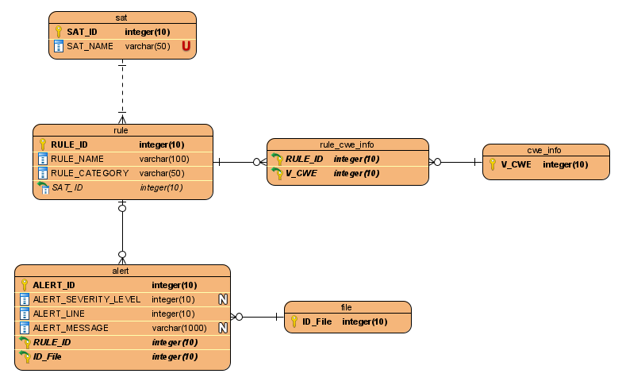

# Scripts

This directory includes the following Python scripts:

* `estagio.py` contains utility functions or classes that are used by multiple scripts.

* `import-dataset.py` imports the software vulnerability and metrics dataset into a MySQL database called 'software'. The MySQL server must be started before using this script. By default, this script imports the data without the timeline information (extra_time tables). To import the complete dataset, use the `-complete` command line argument.

* `add-cwe-to-vulnerabilities.py` queries the software vulnerability database for any CVE record that is missing its respective CWE value. This value is then scraped from the [CVE Details website](https://www.cvedetails.com/) and added to the 'V_CWE' column in the 'vulnerabilities' table.

* `add-vulnerability-categories-and-cwe-information.py` creates or updates two tables in the software vulnerability database:
	
    * 'vulnerability_categories', which contains the names of various vulnerability categories. These were taken from the paper "On the Use of Open-Source C/C++ Static Analysis Tools in Large Projects" (page 3).

    * 'cwe_info', which maps a CWE value to its description/summary and one of the category in the previous table. These descriptions are scraped from the "cwe.mitre.org" website.

* `add-repositories-foreign-key-column-to-vulterabilities.py` adds a new column to the 'vulnerability' table that represents the foreign key for the 'repository_samples' table (the R_ID column). This relation is made based on the value of the V_ID column in the 'vulnerability' table.

* `explore-cve-details-scraper.py` explores the information available in the [CVE Details website](https://www.cvedetails.com/) by using its JSON API and by scraping some of its CVE pages. No connections to the software vulnerabilities database are made.

* `explore-mfsa-scraper.py` explores the information available in the [Mozilla Foundation Security Advisories (MFSA) website](https://www.mozilla.org/en-US/security/advisories/) by scraping some of its pages. No connections to the software vulnerabilities database are made.

* `run-sats.py` currently explores the various types of data that are generated by static analysis tools (SATs). The goal is to eventually add some of this information to the software vulnerability database. This script uses the SATs [Cppcheck](http://cppcheck.sourceforge.net/) and [Flawfinder](https://dwheeler.com/flawfinder/).

## Requirements

The following Python libraries are required to run all of the previous scripts. Check the comment at the top of each script to see its specific dependencies. These may be obtained using the [`pip`](https://pypi.org/project/pip/) package installer:

```
pip install mysql-connector-python
pip install requests
pip install beautifulsoup4
pip install lxml
```

You must also create the following database configuration file in the directory where the scripts are executed. This file must be named **database.config** and should contain the correct connection parameters and user credentials.
```
host=127.0.0.1
port=3306
user=root
password=
database=software
```

## Usage Order

Before most scripts can be used, the dataset must be imported into a database using `import-dataset.py`, with or without the `-complete` option depending on the desired information.

The CWE values are first added to an existing table in the database by using `add-cwe-to-vulnerabilities.py`. Then, `add-vulnerability-categories-and-cwe-information.py` is run to add the vulnerability categories table (if it doesn't exist), and to create or update another table which maps these CWE values to their respective category.

The script `add-repositories-foreign-key-column-to-vulterabilities.py` may be run either before or after the previous step.

The script `run-sats.py` currently does not connect to the database, but it will eventually add the information generated by SATs to new tables.

The scripts `explore-cve-details-scraper.py` and `explore-mfsa-scraper.py` do not depend on the software vulnerability database and may be used in any order.

## CVE Details and MFSA

This section lists any information that can be retrieved from the [CVE Details](https://www.cvedetails.com/) and [MFSA](https://www.mozilla.org/en-US/security/advisories/) websites.

### MFSA Page Layout

First Page Layout (Description -> Workaround -> References): from [MFSA 2005-01](https://www.mozilla.org/en-US/security/advisories/mfsa2005-01/) until [MFSA 2016-84](https://www.mozilla.org/en-US/security/advisories/mfsa2016-84/).

Second Page Layout (CVE List): from [MFSA 2016-85](https://www.mozilla.org/en-US/security/advisories/mfsa2016-85/) until [MFSA 2020-44](https://www.mozilla.org/en-US/security/advisories/mfsa2020-44/) (present).

A few CVE Details examples to consider:
* [CVE-2019-17351](https://www.cvedetails.com/cve/CVE-2019-17351/) (Linux Kernel)
* [CVE-2019-11754](https://www.cvedetails.com/cve/CVE-2019-11754/) (Mozilla Firefox) which references [MFSA 2019-31](https://www.mozilla.org/en-US/security/advisories/mfsa2019-31/)

### Common Information
1. CVE
2. Publish Date
3. Products Affected
4. References (MFSA -> Bugzilla, CVE Details -> GitHub, Bugzilla, MFSA, etc)

### CVE Details Only
1. CVSS Score
2. Impact (Confidentiality, Integrity, Availability)
3. Access Complexity
4. Authentication
5. Gained Access
6. Vulnerability Types
7. CWE
8. Versions Affected

### MFSA Only
1. Impact Key
2. Fixed In Version

### Flowchart

The following image shows the how this information can be retrieved, combined, and inserted into the database.


## Database Relationship Diagrams

This section contains any useful entity–relationship (ER) diagrams that represent various parts of the software vulnerability database.

### Original Database

The following image shows a simplified version of the original software vulnerability database.


### Partial Database

The following autogenerated diagram shows some tables from the software vulnerability database.


### SAT Tables

The following image shows the tables that contain the information generated by SATs ([Cppcheck](http://cppcheck.sourceforge.net/), [Flawfinder](https://dwheeler.com/flawfinder/), etc).


